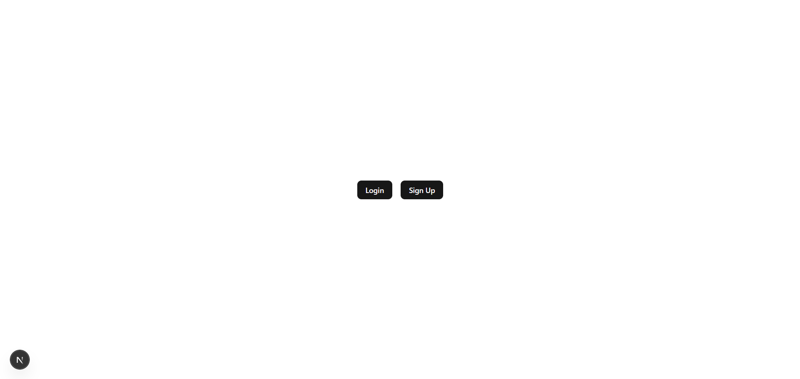
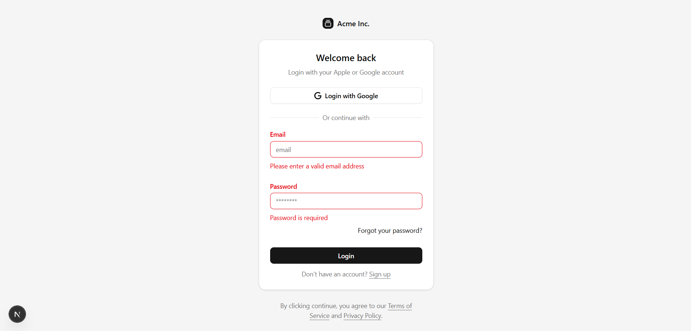
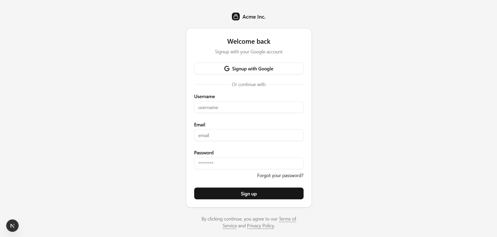
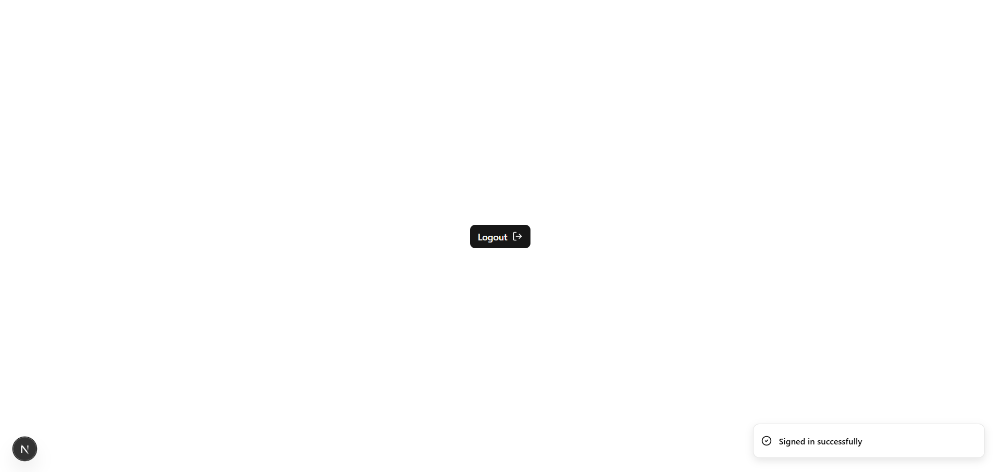

Better Auth + Drizzle + Next.js App

A fully implemented authentication system using Better Auth, Drizzle ORM, and Next.js App Router.
This project includes user registration, login, session handling, protected routes, and a clean modern folder structure suitable for production-level apps and portfolio usage.

✨ Features

User registration & login using Better Auth

Secure session handling

Protected routes

Full Drizzle integration

ShadCN UI components

Modern, clean App Router structure

📦 Tech Stack

Next.js

TypeScript

Better Auth

Drizzle ORM

